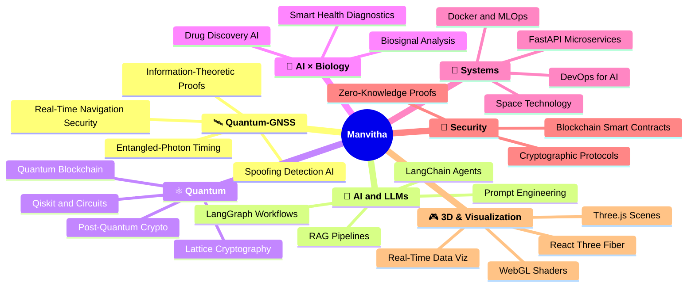

<div align="center">

<!-- ANIMATED HEADER -->


</div>

<div align="center">

<!-- MULTI-LINE TYPING ANIMATION -->


<br/><br/>

<!-- STATUS BADGES -->
<a href="https://github.com/Manvitha3004"></a>


<br/><br/>

<!-- SOCIAL LINKS -->
[](https://www.linkedin.com/in/manvitha-reddy-812026256/)
[](https://github.com/Manvitha3004)
[](https://leetcode.com/u/Manvithareddy30/)
[](mailto:manvithareddy3004@gmail.com)

</div>

---


## 🧑‍💻 About Me

```python
#!/usr/bin/env python3
# ━━━━━━━━━━━━━━━━━━━━━━━━━━━━━━━━━━━━━━━━━━━━━━━━━━━━━
#  manvitha_reddy.py  |  CS Undergrad  |  India 🇮🇳
# ━━━━━━━━━━━━━━━━━━━━━━━━━━━━━━━━━━━━━━━━━━━━━━━━━━━━━

class ManvithaReddy:

    def __init__(self):
        self.name         = "Manvitha Reddy"
        self.education    = "B.Tech Computer Science"
        self.location     = "India 🇮🇳"
        self.email        = "manvithareddy3004@gmail.com"

        self.flagship_projects = {
            "🛰️  Quantum-GNSS":     "Quantum-enhanced GNSS spoofing detection via entangled-photon timing + AI",
            "⛓️  Quantum-Blockchain": "Post-quantum cryptographic blockchain prototype",
            "🤖  LLM Agent Stack":   "Production-grade agents with LangChain & LangGraph",
            "🧬  Smart Health AI":   "Biosignal + AI-powered smart health diagnostics",
        }

        self.currently_building = [
            "🤖  LLM agents with LangChain & LangGraph",
            "⛓️  Quantum-resistant blockchain systems",
            "🛰️  Real-time satellite spoofing detection",
            "🚀  FastAPI backends for intelligent systems",
        ]

        self.learning = [
            "Qiskit & quantum circuit design",
            "Post-quantum cryptography (lattice-based)",
            "MLOps & DevOps for AI pipelines",
            "Space technology & satellite systems",
        ]

        self.ask_me_about = [
            "LLMs", "RAG", "FastAPI", "Quantum-GNSS", "Blockchain", "Quantum Computing"
        ]

        self.fun_fact = "I debug better at 2 AM ☕  |  28 repos and growing 🚀"

    def mission(self) -> str:
        return (
            "Build systems that didn't exist yesterday. "
            "Learn something that challenges you today. "
            "Ship something that inspires someone tomorrow. 🚀"
        )

me = ManvithaReddy()
print(me.mission())
```


## 🚀 Featured Projects

<div align="center">

<!-- PROJECT CARDS -->
<a href="https://github.com/Manvitha3004/Quantum-GNSS">
  
</a>
<a href="https://github.com/Manvitha3004/46STACKUNDERFLOW">
  
</a>
<a href="https://github.com/Manvitha3004/FITNESSAPP">
  
</a>
<a href="https://github.com/Manvitha3004/Dynamic-Dragon">
  
</a>

</div>


## ⚡ Tech Arsenal

<div align="center">

### 🧠 Languages
<p>

</p>

### 🤖 AI / ML / LLM Stack
<p>

&nbsp;


</p>

### 🌐 Frontend & Backend
<p>

</p>

### ⚛️ 3D & Visualization Frameworks
<p>


</p>

### 🗄️ Data & DevOps
<p>

</p>

### 🔬 Research & Emerging Tech
<p>


</p>

</div>


## 📊 GitHub Analytics

<div align="center">

<!-- 3D Activity Graph -->
<a href="https://github.com/Manvitha3004">
  
</a>

<br/>

<!-- Stats + Languages Row -->


<br/>

<!-- Streak -->


<br/>

<!-- 3D Trophy Shelf -->


</div>


## 🌌 Research Universe




## 🐍 Contribution Snake

<div align="center">
<picture>
  <source media="(prefers-color-scheme: dark)" srcset="https://raw.githubusercontent.com/Manvitha3004/Manvitha3004/output/github-contribution-grid-snake-dark.svg" />
  <source media="(prefers-color-scheme: light)" srcset="https://raw.githubusercontent.com/Manvitha3004/Manvitha3004/output/github-contribution-grid-snake.svg" />
  
</picture>
</div>


## 🎯 2025 Roadmap

<div align="center">

| 🗓️ Quarter | 🎯 Goal | 🛠️ Stack | 📌 Status |
|:----------:|---------|:--------:|:---------:|
| Q1 | Production-grade LLM agent pipeline | LangChain · LangGraph · FastAPI | 🔄 In Progress |
| Q2 | Quantum-safe blockchain prototype | Qiskit · Solidity · Lattice Crypto | 🔄 In Progress |
| Q2 | Quantum-GNSS paper & open-source release | Python · Qiskit · Three.js viz | 🔄 In Progress |
| Q3 | Open-source AI × biology tool | PyTorch · BioPython · FastAPI | 📋 Planned |
| Q4 | Research paper on post-quantum systems | Qiskit · Web3 · LaTeX | 📋 Planned |

</div>


## 🧊 3D Framework Stack

<div align="center">

> **I build immersive 3D visualizations and interactive experiences for complex scientific & AI systems**

| Framework | Use Case | Status |
|-----------|----------|--------|
| **Three.js** | Quantum circuit 3D visualizer, satellite orbit rendering | ✅ Using |
| **React Three Fiber** | Interactive 3D dashboards inside React apps | ✅ Using |
| **Babylon.js** | High-fidelity physics simulations for GNSS systems | 🔄 Learning |
| **D3.js** | Real-time LLM agent graphs & blockchain analytics | ✅ Using |
| **WebGL / GLSL** | Custom shaders for quantum entanglement visualization | 🔄 Learning |
| **Plotly / Dash** | Scientific data visualization for quantum experiments | ✅ Using |

</div>


## 🔧 Snake Setup — GitHub Actions

<details>
<summary>⚙️ Click to expand snake workflow setup</summary>

Create `.github/workflows/snake.yml` in your **Manvitha3004/Manvitha3004** profile repo:

```yaml
name: Generate Snake Animation
on:
  schedule:
    - cron: "0 0 * * *"
  workflow_dispatch:
jobs:
  generate:
    runs-on: ubuntu-latest
    steps:
      - uses: Platane/snk@v3
        with:
          github_user_name: Manvitha3004
          outputs: |
            dist/github-contribution-grid-snake.svg
            dist/github-contribution-grid-snake-dark.svg?palette=github-dark
      - uses: crazy-max/ghaction-github-pages@v3
        with:
          target_branch: output
          build_dir: dist
        env:
          GITHUB_TOKEN: ${{ secrets.GITHUB_TOKEN }}
```

</details>


## 💬 Dev Quote of the Day

<div align="center">

</div>

---

## ✨ Closing Thought

<div align="center">


</div>

<!-- FOOTER WAVE -->


<div align="center">
  <sub>Crafted with 💗 by Manvitha Reddy &nbsp;|&nbsp; <a href="https://github.com/Manvitha3004">⭐ Star a repo if you like what you see!</a></sub>
</div>
