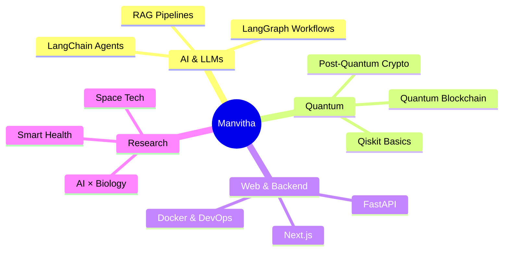

<div align="center">

<!-- 3D Animated Header -->


<!-- Typing Animation -->


<br/>

<!-- Social Badges -->
[](https://www.linkedin.com/in/manvitha-reddy-812026256/)
[](https://github.com/Manvitha3004)
[](https://leetcode.com/u/Manvithareddy30/)
[](mailto:manvithareddy3004@gmail.com)

</div>

---

## About Me

```python
class Manvitha:
    def __init__(self):
        self.name        = "Manvitha Reddy"
        self.role        = "CS Undergrad | AI & Emerging Tech Builder"
        self.location    = "India 🇮🇳"
        self.interests   = [
            "LLM Agents & Autonomous Systems",
            "Quantum-Safe Blockchain",
            "Space Technology",
            "AI × Biology (Smart Health)",
            "Post-Quantum Cryptography",
        ]
        self.stack       = ["Python", "FastAPI", "LangChain", "Next.js", "Docker"]
        self.currently   = "Building things that didn't exist yesterday 🛠️"

    def greet(self):
        return "Let's build the future, one commit at a time 🚀"
```

---

## Tech Stack

<div align="center">

### Languages


### AI / LLM


### Frameworks & Backend


### Databases & Cloud


</div>

---

## GitHub Stats

<div align="center">

<!-- 3D Contribution Graph -->


<br/>


<br/>

<!-- GitHub Streak -->


<br/>

<!-- 3D Trophy -->


</div>

---

---

## What I'm Exploring

<div align="center">

| Domain | 🔧 Focus Area |
|-----------|--------------|
| AI Agents | LangChain, LangGraph, Autonomous pipelines |
| Blockchain | Quantum-resistant cryptography & smart contracts |
| AI × Biology | Smart health diagnostics & biosignal analysis |
| Security | Post-quantum systems, lattice-based crypto |
| Quantum Computing | Foundations, Qiskit, quantum circuits |
| DevOps for AI | MLOps, CI/CD for LLM-powered systems |

</div>

---

## 3D Skill Sphere

<div align="center">

[](https://github.com/Manvitha3004)

</div>

---

## Current Focus



---

## Inspiration

<div align="center">


<br/><br/>


</div>

---

<!-- 3D Wave Footer -->


<div align="center">
  <sub>⭐ If you find my work interesting, consider starring some repos! Made with 💗 by Manvitha</sub>
</div>
